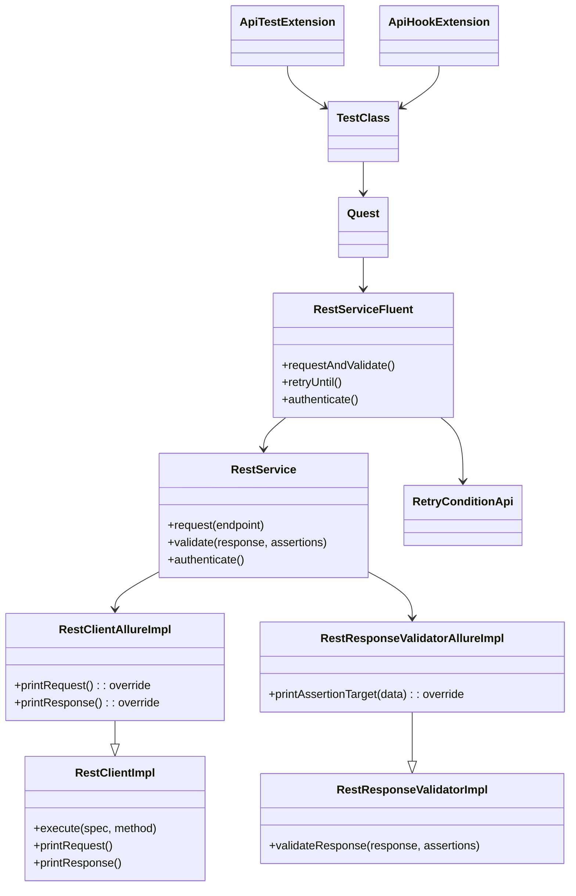
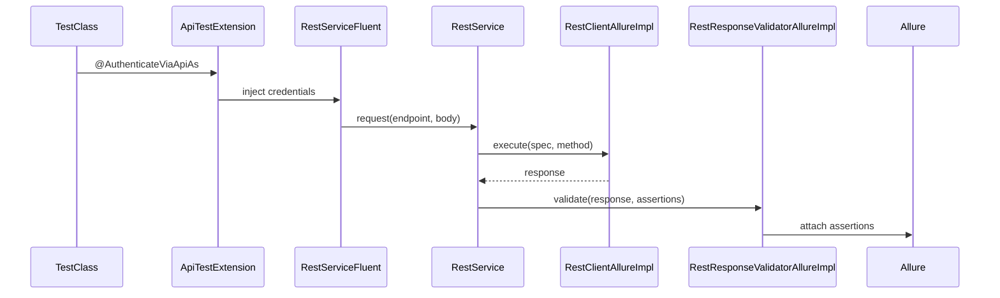

# API Interactor Test Framework Adapter (`api-interactor-test-framework-adapter`)

> 💍 Part of the **One Ring To Rule Them All** test automation framework by Cyborg Code Syndicate

## Purpose

This module enhances the `api-interactor` by integrating test-specific capabilities such as Allure reporting, fluent service chaining, authentication annotations, retry conditions, and JUnit 5 lifecycle hooks. It bridges the API layer with your test orchestration logic (quests, worlds, services) and makes automation declarative, traceable, and resilient.

---

## 🧩 Key Components

### 1. Allure Integration

#### `RestClientAllureImpl`
Extends `RestClientImpl` and attaches:
- Request method, URL, headers
- Request/response bodies
- Status code and duration
- Query params and metadata

#### `RestResponseValidatorAllureImpl`
Extends `RestResponseValidatorImpl` to log:
- Assertion key-value pairs
- Expected vs actual data
- Validation step annotations

---

### 2. Fluent API Service Layer

#### `RestServiceFluent`
Main service used in tests via `quest.enters(OLYMPYS)`:
- `.request(...)`
- `.requestAndValidate(...)`
- `.retryUntil(...)`
- `.authenticate(...)`
- `.validate(...)`

#### `SuperRestServiceFluent`
Groovy-style decorator that extends `RestServiceFluent` dynamically. Enables method extensions like `.createLeaderUserAndValidateResponse()`.

---

### 3. Authentication & Annotations

#### `@API`
Marks a test class as an API test. Auto-enables:
- `ApiTestExtension` (handles authentication)
- `ApiHookExtension` (handles setup/teardown hooks)

#### `@AuthenticateViaApiAs`
Injects credentials & authentication strategy before test starts. Works with:
- `Credentials` interface
- `BaseAuthenticationClient` implementations

#### `@ApiHook`, `@ApiHooks`
Used to define lifecycle hooks (before/after class) with custom behavior via reflection-discovered `ApiHookFlow` enums.

---

### 4. Extensions

#### `ApiTestExtension`
Before test, performs pre-authentication and injects credentials into quest storage.

#### `ApiHookExtension`
Executes lifecycle hooks via `@ApiHook`, loads flows reflectively, and stores hook outputs for reuse across the test class.

---

### 5. Retry Utilities

#### `RetryConditionApi`
Predefined retry conditions for:
- HTTP status (e.g. wait until 200)
- Body fields using JsonPath
- `responseFieldEqualsTo`, `responseFieldNonNull`

Integrated with `.retryUntil(...)` in `RestServiceFluent`.

---

### 6. Storage Integration

#### `DataExtractorsApi`
Helpers to extract:
- JSON body values
- Status codes
For assertion, validation, and storage.

#### `StorageKeysApi`
Global enum for scoping values in quest storage:
- `API`, `USERNAME`, `PASSWORD`

---

## 📐 Class Diagram



---

## 📊 Sequence Flow



---

## ✅ Example

```java
@API
public class CreateUserTest extends BaseTestSequential {

   @Test
   @Regression
   public void testCreateUser(Quest quest, @Craft(model = "USER_BASIC") User user) {
      quest.enters(OLYMPYS)
           .requestAndValidate(
               POST_CREATE_USER,
               user,
               Assertion.builder().target(STATUS).type(IS).expected(SC_CREATED).build(),
               Assertion.builder().target(BODY).key("$.name").type(IS).expected(user.getName()).build()
           )
           .complete();
   }
}
```

---

## Related Modules

- [`api-interactor`](../api-interactor/README.md): core REST interaction layer
- [`test-framework`](../test-framework/README.md): quest orchestration, annotations, lifecycle
- [`assertions`](../assertions/README.md): assertion and validation logic

© Cyborg Code Syndicate 💍👨💻
