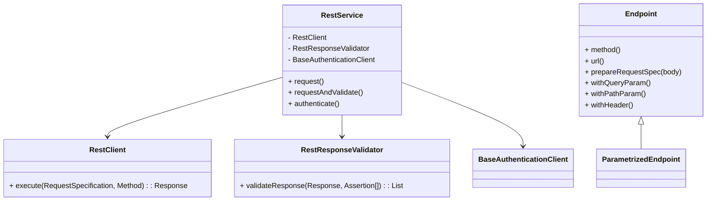

# API Interactor Module (`api-interactor`)

> 💍 Part of the **One Ring To Rule Them All** test automation framework by Cyborg Code Syndicate

## Purpose

The `api-interactor` module provides the reusable, app-agnostic API interaction logic. It handles request execution, dynamic configuration, authentication, endpoint abstraction, and response validation using a fluent and pluggable design.

---

## 📦 Module Overview

| Layer | Responsibility |
|-------|----------------|
| `authentication` | Reusable authentication logic with header caching |
| `client` | REST client abstraction using RestAssured |
| `config` | Centralized API configuration via the `owner` library |
| `core` | Endpoint abstraction for chaining, headers, path/query params |
| `exceptions` | Framework-specific REST errors |
| `log` | Centralized logging for API interactions |
| `service` | High-level orchestrator for calling and validating endpoints |
| `validator` | Assertion-based API response validation |

---

## 🧬 Package Structure



---

## ⚙️ Core Components

### 🔐 Authentication
- `AuthenticationClient` – interface for login flows
- `BaseAuthenticationClient` – handles caching, provides `getAuthentication`
- `AuthenticationKey` – uniquely identifies session

### 🌐 Request Execution
- `RestClient` – executes requests using RestAssured
- `RestClientImpl` – logs body, headers, time, detects slow requests

### 🧩 Endpoint Abstraction
- `Endpoint<T>` – defines `method`, `url`, `headers`, etc.
- `ParametrizedEndpoint` – immutable with chained query/path/header support

### 📜 Configuration (via `owner`)
- `ApiConfig` – defines logging, base URL, etc.
- `ApiConfigHolder` – cached singleton

### 🧪 Validation
- `RestAssertionTarget` – `STATUS`, `BODY`, `HEADER`
- `RestResponseValidatorImpl` – extracts targets, uses `AssertionUtil`

---

## 🧪 Example Usage

```java
// Define endpoint enum implementing Endpoint<T>
MyEndpoint endpoint = MyEndpoint.GET_USER.withPathParam("id", 42);

// Create RestService
RestService restService = ...;

// Optional authentication
restService.authenticate("user", "pass", MyAuthClient.class);

// Request and validate
List<AssertionResult<?>> results = restService.requestAndValidate(
    endpoint,
    Assertion.status().isEqualTo(200),
    Assertion.body("$.name").isEqualTo("Neo")
);
```

---

## 🛠️ How to Extend

### ➕ Add new auth strategy
1. Implement `AuthenticationClient`
2. Extend `BaseAuthenticationClient`
3. Override `authenticateImpl()`

### ➕ Add new endpoint
```java
public enum MyEndpoint implements Endpoint<MyEndpoint> {
    GET_USER;

    public Method method() { return Method.GET; }
    public String url() { return "/users/{id}"; }
    public MyEndpoint enumImpl() { return this; }
}
```

---

## 🧼 Error Handling

| Error | Thrown When |
|-------|-------------|
| `RestServiceException` | Any failure during request execution |
| `InvalidAssertionException` | Assertion setup issues |
| `IllegalArgumentException` | Invalid endpoint, nulls, etc. |

---

## 🧪 Testability & Flexibility

- `RestClientImpl.currentTimeNanos()` can be overridden in tests
- `ApiConfigHolder.resetForTest()` clears cached config
- `RestService` can be injected or constructed manually

---

© Cyborg Code Syndicate 💍👨💻
