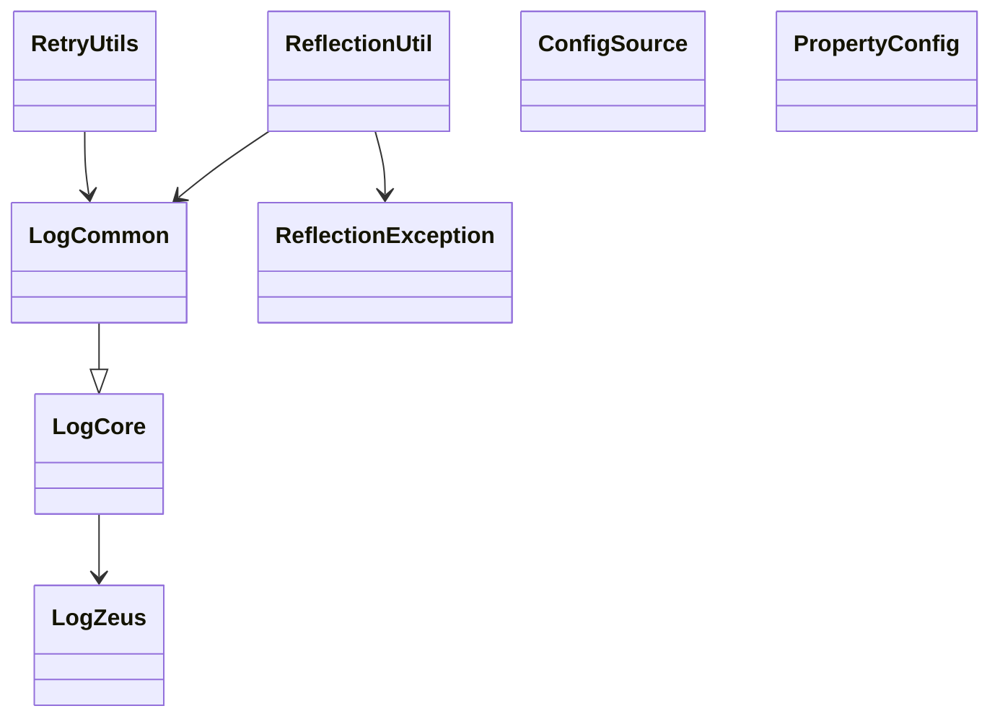

# Commons Module (`commons`)

> 💍 Part of the **One Ring** test automation framework by Cyborg Code Syndicate

## Purpose

The `commons` module provides essential utilities that support the core framework functionalities. It contains configurations, logging utilities, and robust reflection-based tools used across the testing framework.

## Key Components

### 1. Configuration

- **`@ConfigSource`**: A meta-annotation used to identify logical configuration sources.
- **`PropertyConfig`**: Extends `org.aeonbits.owner.Config` to support type-safe property access.

### 2. Logging System

The `logging` package introduces structured, customizable, and scoped logging with custom log levels (`STEP`, `VALIDATION`, `EXTENDED`) and markers.

- **LogCore**: Base logger with support for custom levels and markers.
- **LogCommon**: Singleton wrapper around `LogCore`, offering static access to all logging levels.
- **LogZeus**: Central factory for `Log4j2` loggers and `Marker`s.

### 3. Reflection Utilities

- **`ReflectionUtil`**: Dynamic field access, enum lookup by interface, and class discovery with support for advanced exception reporting.
- **`RetryUtils`**: Retry mechanism for conditional operations with interval and timeout handling, extensively used for flaky or eventual-consistency systems.

---

## Mermaid Diagram

### Class Interaction Overview

---

## Summary

This module is foundational to logging, reflection, and configuration mechanisms in the framework. While it does not execute business logic directly, it supports all other modules by enforcing good logging practices and dynamic extensibility through reflection.