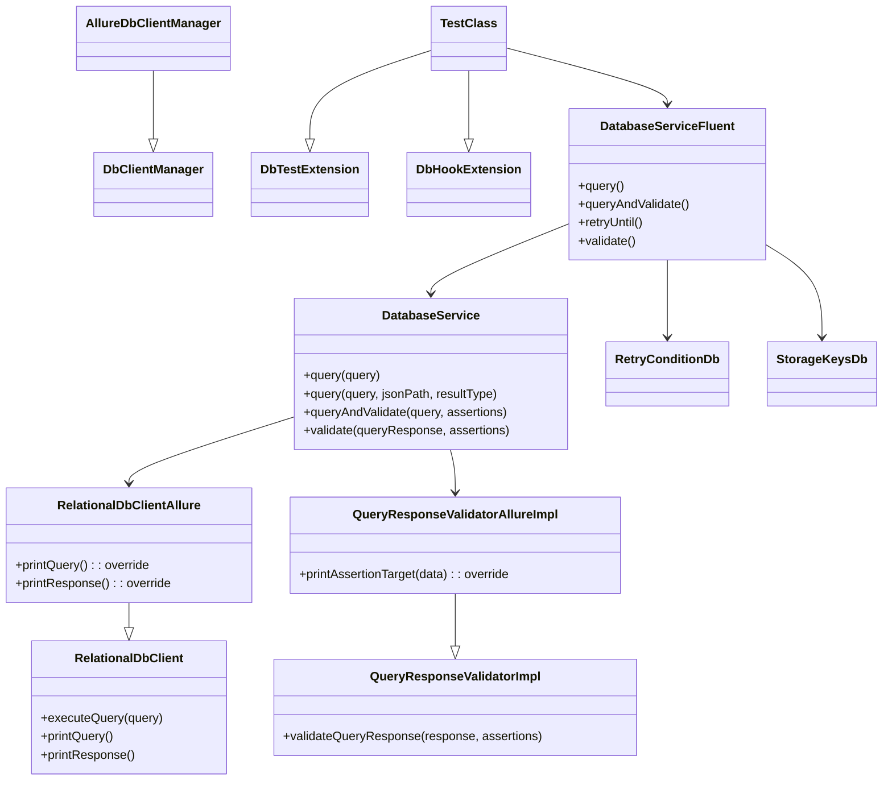
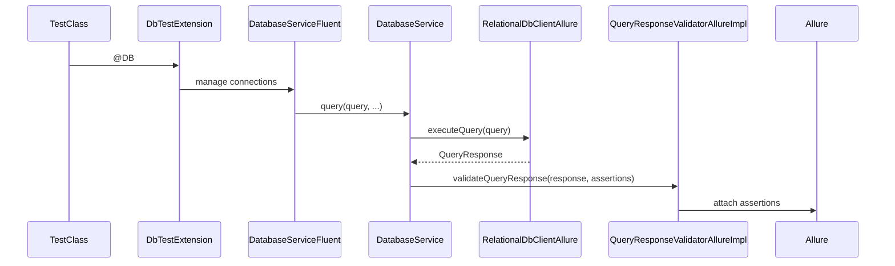

# DB Interactor Test Framework Adapter (`db-interactor-test-framework-adapter`)

> 💍 Part of the **One Ring** test automation framework by Cyborg Code Syndicate

## Purpose

This module extends the `db-interactor` with test-specific functionality for automated database testing. It brings enhanced Allure reporting, fluent service chaining, JUnit 5 lifecycle hooks, database hooks via annotations, retry conditions, and assertion validation for DB query responses. It bridges the DB layer with your quest/test orchestration logic and ensures database automation is structured, traceable, and robust.

---

## 🧩 Key Components

### 1. Allure Integration

#### `RelationalDbClientAllure`
Extends `RelationalDbClient` and attaches:
- SQL query execution as Allure steps
- Query duration and result attachment
- Allure-enhanced logging for both queries and responses

#### `QueryResponseValidatorAllureImpl`
Extends `QueryResponseValidatorImpl` to log:
- Assertion key-value pairs being validated
- Step annotations for assertion/validation actions

---

### 2. Fluent Database Service Layer

#### `DatabaseServiceFluent`
Main service used in tests via `quest.enters(DB)`:
- `.query(...)`
- `.queryAndValidate(...)`
- `.retryUntil(...)`
- `.validate(...)`

---

### 3. Hooks, Annotations & Extensions

#### `@DB`
Marks a test class as a DB test. Auto-enables:
- `DbTestExtension` (handles connection lifecycle)
- `DbHookExtension` (handles setup/teardown hooks)

#### `@DbHook`, `@DbHooks`
Defines lifecycle hooks (before/after class) with custom DB logic using reflective `DbHookFlow` enums.

#### `DbTestExtension`
Closes all DB connections after tests finish.

#### `DbHookExtension`
Executes class lifecycle hooks via `@DbHook`, loads flows reflectively, and stores hook outputs for reuse across the test class.

---

### 4. Retry Utilities

#### `RetryConditionDb`
Predefined retry conditions for:
- Waiting until a query returns rows
- Waiting until a query returns a specific value using JsonPath

Integrated with `.retryUntil(...)` in `DatabaseServiceFluent`.

---

### 5. Storage Integration

#### `StorageKeysDb`
Global enum for scoping DB-related values in quest storage:
- `DB`

---

## 📐 Class Diagram



---

## 📊 Sequence Flow



---

## ✅ Example

```java
@DB
public class UserDataDbTest extends BaseTestSequential {

   @Test
   @Regression
   public void testUserExists(Quest quest) {
      quest.enters(DB)
           .queryAndValidate(
               FIND_USER_BY_EMAIL.withParam("email", "test@example.com"),
               Assertion.builder()
                        .target(NUMBER_ROWS)
                        .type(IS)
                        .expected(1)
                        .build()
           )
           .complete();
   }
}
```

---

## Related Modules

- [`db-interactor`](../db-interactor/README.md): core DB interaction layer
- [`test-framework`](../test-framework/README.md): quest orchestration, annotations, lifecycle
- [`assertions`](../assertions/README.md): assertion and validation logic
