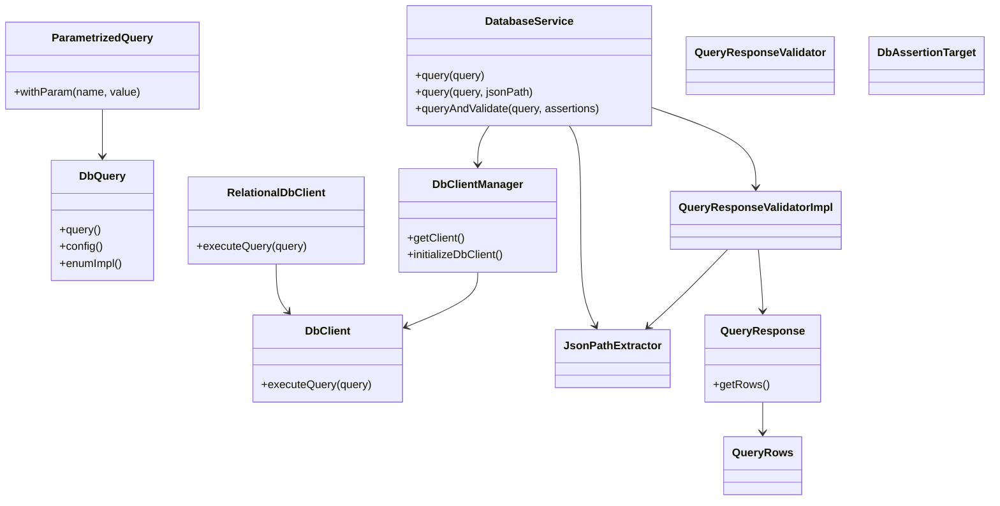
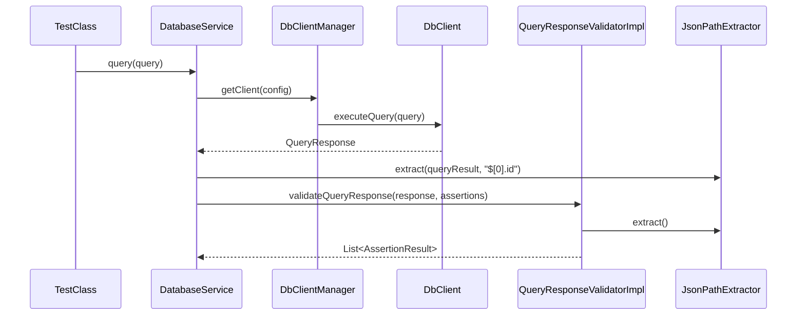

# DB Interactor Module (`db-interactor`)

> 💍 Part of the **One Ring** test automation framework by Cyborg Code Syndicate

## Purpose

The `db-interactor` module serves as the core engine for database interaction in the Zeus automation framework. It enables structured query execution, dynamic parameter substitution, JSON-based value extraction, assertion-driven validation, and connection management.

---

## ⚙️ Architecture Overview

The module is composed of several subpackages:

- **client**: Handles the execution of raw SQL via JDBC.
- **config**: Loads DB configs and resolves DB type via enum+reflection.
- **connector**: Caches and initializes DB connections.
- **query**: Represents and manipulates SQL query models and responses.
- **validator**: Applies assertions and extracts values using JsonPath.
- **json**: Parses and extracts values using JSONPath from result sets.
- **log**: Provides `LogDb` abstraction for logging query and validation steps.

---

## 🔁 Flow Summary

1. `DbQuery` defines a static or enum-backed SQL query.
2. `DatabaseService.query(...)` retrieves a `DbClient` from `DbClientManager`.
3. `RelationalDbClient` executes the query and returns a `QueryResponse`.
4. You can extract values using JSONPath via `jsonPathExtractor`.
5. You can validate query results using assertion targets like `QUERY_RESULT`, `NUMBER_ROWS`, and `COLUMNS`.
6. Assertion evaluation is delegated to the `validator` submodule using the shared `AssertionUtil`.

---

## 🧠 Supported Assertion Targets

| Target        | Description                                  |
|---------------|----------------------------------------------|
| `QUERY_RESULT`| Validates values extracted via JsonPath      |
| `NUMBER_ROWS` | Asserts how many rows were returned          |
| `COLUMNS`     | Asserts column presence from result metadata |

---

## 🔍 Key Class Responsibilities

| Class | Responsibility |
|-------|----------------|
| `DbQuery` / `ParametrizedQuery` | Represents queries, allows token replacement |
| `DatabaseService` | Central orchestrator for DB execution and validation |
| `RelationalDbClient` | JDBC-based query execution and result parsing |
| `DbClientManager` | Caches DB clients per connection URL |
| `DbConfig` / `DbTypeConverter` | Resolves database config and type via OWNER and reflection |
| `QueryResponseValidatorImpl` | Evaluates assertions on `QueryResponse` |
| `JsonPathExtractor` | Performs dynamic value extraction from query results |

---

## 🔄 Mermaid: Class Diagram



---

## ▶️ Example Flow (Sequence)



---

## 💡 Notes

- All DB operations are logged using `LogDb` with structured step, debug, and extended messages.
- `DbTypeConverter` uses `ReflectionUtil` to discover valid database enum via `DbType` interface.
- You can override the connection string entirely by using `db.full.connection.string`.
- Assertion validation shares logic with the general-purpose assertion engine (`assertions` module).

---

## 📁 Package Breakdown

```
db-interactor
├── client         → Execution layer (RelationalDbClient, DbClientManager)
├── config         → Configuration + Reflection-backed DbType resolution
├── connector      → Connection caching and driver loading
├── query          → Query models, parameter support, and responses
├── validator      → Assertion validation against query results
├── json           → JsonPath-based extraction logic
├── exceptions     → Custom runtime exceptions
├── log            → Log wrapper for all DB operations
```

---
