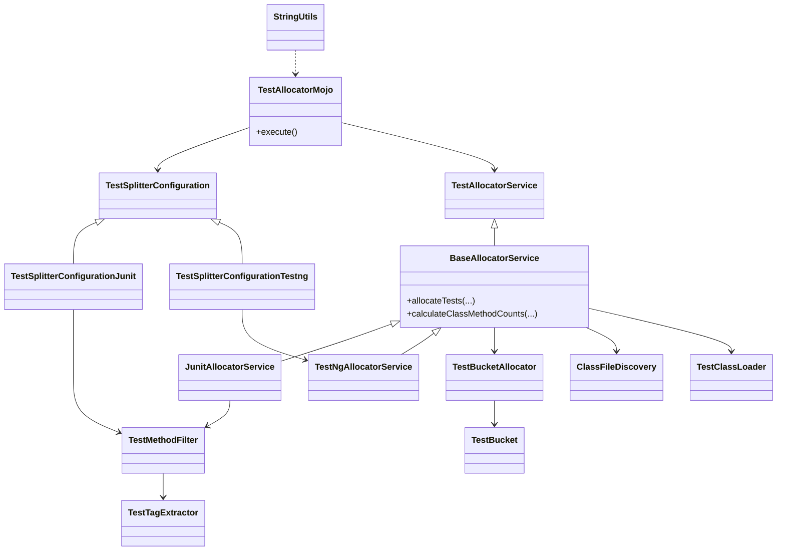

# Test Allocator Maven Plugin

> 💍 Part of the **One Ring To Rule Them All** test automation framework by Cyborg Code Syndicate

## Purpose

A Maven plugin by **Cyborg Code Syndicate** for splitting, filtering, and grouping Java test classes (JUnit/TestNG) into execution buckets, enabling parallel test execution and efficient CI pipelines.

---

## Features

- **Test Splitting:** Automatically splits test classes into groups/buckets based on test method count.
- **Parallelization:** Supports configuring maximum methods per bucket and parallel runner limits.
- **Test Filtering:**
  - **JUnit:** Filter test methods by included/excluded tags.
  - **TestNG:** Select specific test suites for execution.
- **Flexible Engines:** Works with both JUnit and TestNG out of the box.
- **JSON Output:** Exports grouped test allocation for downstream use.

---

## Class/Module Structure (High-Level)



---

## How It Works

1. **Configuration**: Set plugin parameters (test engine, filtering, splitting) in your `pom.xml` or via CLI.
2. **Discovery**: Finds compiled test class files in your build output.
3. **Filtering**: Applies tag/suite filters (JUnit/TestNG) as configured.
4. **Grouping**: Distributes classes into buckets/groups using method counts & config limits.
5. **Output**: Generates a JSON file mapping groups to classes/methods for parallel execution.

---

## Usage Example

In your `pom.xml`:
```xml
<build>
  <plugins>
    <plugin>
      <groupId>com.theairebellion.zeus.maven.plugins</groupId>
      <artifactId>test-allocator-maven-plugin</artifactId>
      <version>1.0.0</version>
      <executions>
        <execution>
          <goals>
            <goal>split</goal>
          </goals>
        </execution>
      </executions>
      <configuration>
        <enabled>true</enabled>
        <testEngine>junit</testEngine>
        <tagsInclude>fast,critical</tagsInclude> <!-- JUnit only -->
        <tagsExclude>slow,legacy</tagsExclude>   <!-- JUnit only -->
        <suites>smoke,regression</suites>        <!-- TestNG only -->
        <maxMethods>20</maxMethods>
        <parallelMethods>true</parallelMethods>
        <maxNumberOfParallelRunners>10</maxNumberOfParallelRunners>
        <jsonOutputFile>grouped-tests</jsonOutputFile>
      </configuration>
    </plugin>
  </plugins>
</build>
```

Or via CLI:
```sh
mvn com.theairebellion.zeus.maven.plugins:test-allocator-maven-plugin:split   -DtestSplitter.enabled=true   -DtestSplitter.test.engine=junit   -DtestSplitter.junit.tags.include=fast,critical   -DtestSplitter.junit.tags.exclude=slow   -DtestSplitter.maxMethods=15   -DtestSplitter.parallel.methods=true   -DtestSplitter.max.number.runners=8
```

---

## Output JSON Format

The plugin generates a file (default `grouped-tests.json`) with the structure:

```json
[
  {
    "jobIndex": 0,
    "classes": ["com.foo.TestClass1", "com.foo.TestClass2"],
    "totalMethods": 18
  },
  {
    "jobIndex": 1,
    "classes": ["com.foo.TestClass3"],
    "totalMethods": 7
  }
]
```

---

## Key Classes

- **TestAllocatorMojo**: The Maven plugin entrypoint and configuration handler.
- **TestSplitterConfiguration***: Configuration models for JUnit/TestNG.
- **BaseAllocatorService**: Abstract service for allocating classes into buckets.
- **JunitAllocatorService / TestNgAllocatorService**: Engine-specific implementations.
- **TestBucket / TestBucketAllocator**: Bucket logic for grouping classes.
- **ClassFileDiscovery, TestClassLoader**: Utilities for finding/loading class files.
- **TestMethodFilter, TestTagExtractor**: JUnit filtering logic by tags.
- **StringUtils**: Helper for parsing input lists.

---

## Advanced
- Works seamlessly with custom test runners and CI environments.
- Handles sequential (non-parallel) and parallel test allocation.
- Supports both annotation-based and suite-based test discovery.

---

© Cyborg Code Syndicate 💍👨💻