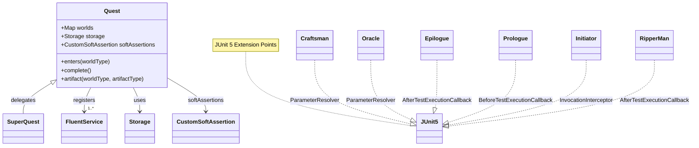
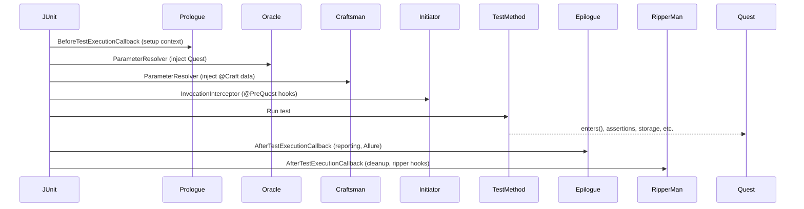
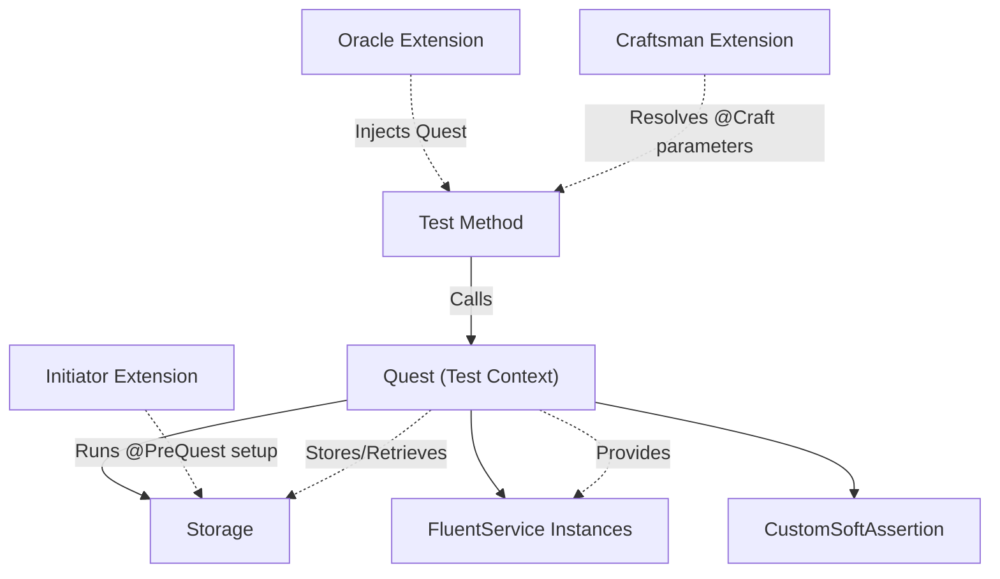
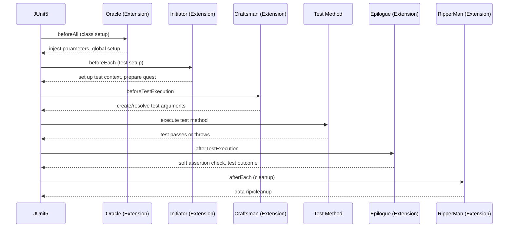
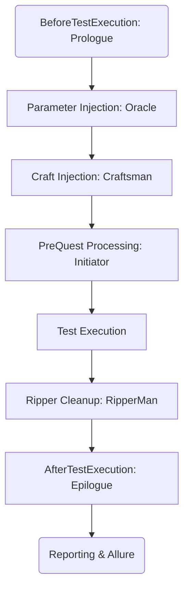
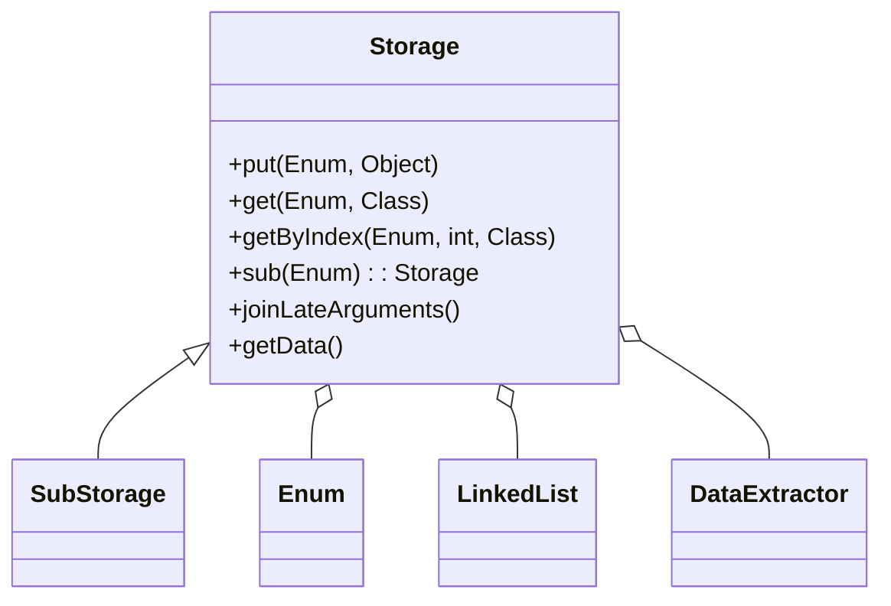
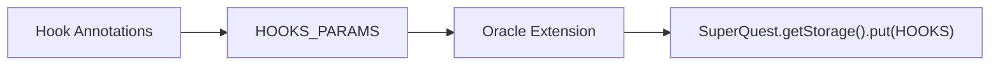
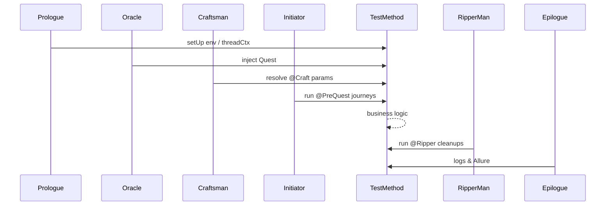
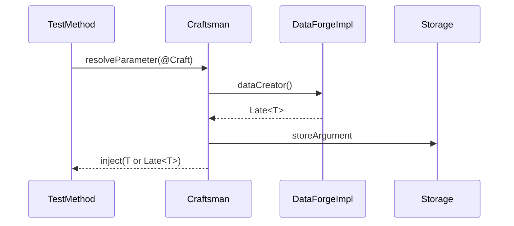

# One Ring Test Framework

> **Welcome to the heart of the “One Ring to Rule Them All” test-automation ecosystem.**  
> This module orchestrates your test scenarios, injects services and data, manages execution context, and makes writing *insanely* maintainable Java automation as fun as it should be.
>
> **Rule your tests. Don’t let them rule you.**


## Concepts & Architecture

### Core Building Blocks

| Concept | What it *really* is |
|---------|---------------------|
| **Quest** | The heart of a single test run — owns state, registered “worlds,” storage, and soft-assertions. |
| **World** | A *fluent* test service (e.g., `UiService`, `ApiService`). You *enter* a world, call its DSL, and harvest its artifacts. |
| **SuperQuest** | A decorator around `Quest` that injects extra powers (decorator pattern) without polluting the base class. |
| **Storage** | Thread-safe, enum-keyed, hierarchical vault. Remembers anything (objects, lists, Late\<T\>, hook data). |
| **Extensions** | JUnit 5 extension suite that wires everything together — parameter injection, lifecycle callbacks, hooks, Allure glue. |




## Data & Parameter Injection Flow



### How It Works

| Phase | What Happens |
| --- | --- |
| **Prologue** | Sets up the test environment, logs the start, wires Allure, and sets the thread context |
| **Quest Injection** | **Oracle** extension injects a fresh, decorated **Quest / SuperQuest** ready to register services and manage state |
| **Data Injection** | **Craftsman** resolves parameters annotated with `@Craft`, generating data models (lazy or immediate) and injecting them |
| **Pre-Test Hooks** | **Initiator** executes any `@PreQuest` logic — sets up data, calls preconditions, and attaches metadata to Allure |
| **Test Execution** | Test code calls `quest.enters(SomeService.class)`, performs actions, stores/fetches data, and asserts |
| **Tear-Down & Reporting** | **Epilogue** logs outcome & duration, attaches filtered logs and HTML description to Allure; **RipperMan** performs annotated cleanup |
| **Thread Context** | **QuestHolder** keeps the Quest context thread-local and clears it after completion |


## 1. Sequence Diagram: Full Test Lifecycle (JUnit5 + Zeus Extensions)



### Extension Points and Responsibilities

| Extension | JUnit 5 Callback / Phase | Responsibility | Real-World Analogy |
| --- | --- | --- | --- |
| **Oracle** | `beforeAll` | Class-level setup, injects `Quest` / `SuperQuest` into the test | The quest-giver (sets the challenge, arms the party) |
| **Initiator** | `beforeEach` | Creates per-test context, runs `@PreQuest` journeys | The journey leader (maps the route, prepares the path) |
| **Craftsman** | `beforeTestExecution` | Resolves `@Craft` parameters via `DataForge`, injects test data | The quartermaster / artisan (forges tools & data) |
| **Epilogue** | `afterTestExecution` | Collects soft assertions, logs outcome, attaches logs & HTML to Allure | The chronicler (records and verifies the adventure) |
| **RipperMan** | `afterEach` | Executes cleanup via `@Ripper`, removes test artifacts | The cleaner (erases traces when the quest ends) |




## 2. Test Data Creation, Storage, and Cleanup

**Scenario: The Life of a Crafted Data Object**

### End-to-End Data Lifecycle (`@Craft` + `Late` + `@Ripper`)

| # | Phase | What Actually Happens | Framework Touch-Points |
|---|---|---|---|
| **1** | **Declaration in Test** | ``` @Craft(UserForge.ADMIN) User adminUser ``` | Test method |
| **2** | **Lazy Instantiation (`Late`)** | * `UserForge.ADMIN`’s `dataCreator()` returns a `Late<User>`.<br>* The real `User` is materialized only on the first `join()` call (triggered inside **Craftsman**). | `Craftsman` extension |
| **3** | **Runtime Usage** | The `adminUser` instance is passed to FluentService calls, validations, etc. | Test + FluentService |
| **4** | **Storage & Isolation** | * Cached under `StorageKeysTest.ARGUMENTS → UserForge.ADMIN`.<br>* Lives inside the thread-local `Quest` context (`QuestHolder` ensures isolation). | `SuperQuest.getStorage()` |
| **5** | **Cleanup (`Rip`)** | * After the test, **RipperMan** inspects any `@Ripper` annotations.<br>* Finds the corresponding `DataRipper` (e.g., `UserRipper.ADMIN`) and deletes / rolls back the `User` in DB or external system. | `RipperMan` extension |


### Data Object Lifecycle

```mermaid
flowchart TD
    T[Test Method] -->|@Craft| DF[DataForge]
    DF -->|Late_Object| LC[Lazy Creation]
    LC -->|join_call| U[Object In Test]
    U -->|store| ST[Storage]
    ST -->|enum_key| RM[RipperMan]
    RM -->|cleanup| C[Cleanup]
```

### Extension Roles Table

| Extension     | Responsibility | Phase               | Key Annotations        |
|---------------|----------------|---------------------|------------------------|
| `Prologue`    | Setup context & metadata | Before Test | — |
| `Oracle`      | Injects Quest / Static Data | ParameterResolver | `@TestStaticData` |
| `Craftsman`   | Injects model data | ParameterResolver | `@Craft` |
| `Initiator`   | Processes `@PreQuest` logic | InvocationInterceptor | `@PreQuest`, `@Journey` |
| `Epilogue`    | Logging, test result capture | AfterTestExecution | — |
| `RipperMan`   | Cleanup logic post-execution | AfterTestExecution | `@Ripper` |

## 3. Storage System Internals

**Diagram: Storage System Architecture**



### Storage Patterns

**Main Storage** – every test gets its own `Storage` instance, indexed by enum keys  
**Sub-Storages** – hierarchical buckets like `ARGUMENTS`, `PRE_ARGUMENTS`, etc.  
**Late binding** – any `Late<T>` objects are resolved (`join()`) before `quest.complete()`  
**Data extraction** – use `DataExtractor` helpers to fetch values by key / index / type  

**Safe extraction example**
```java
// Build an extractor that knows where (and how) to grab the ADMIN user
DataExtractor<User> adminExtractor = new DataExtractorImpl<>(
            StorageKeysTest.ARGUMENTS,            // sub-storage (optional)
            UserKey.ADMIN,                        // primary enum key
            obj -> (User) obj                     // cast / transform logic
      );

// Fetch the latest ADMIN user from storage in a type-safe way
User admin = storage.get(adminExtractor, User.class);
```

### Storage Access Example

```java
String userId = quest.getStorage()
   .sub(ARGUMENTS)
   .get(UserData.USER_ID, String.class);
```

## 4. Hooks, Storage Flow & Extension Points Reference



**Extension Points Overview**

- **`@PreQuest` / `PreQuestJourney`** – declarative pre-conditions that run **before** the test method  
  _Example:_ seed DB, create prerequisite users, prime caches.

- **`@Ripper` / `DataRipper`** – cleanup hooks executed **after** the test method  
  _Example:_ delete test data, roll back transactions, purge message queues.

- **`AllureStepHelper` hooks** – enrich reports with filtered logs, HTML blocks, env-props & categories.

- **Custom Spring `ContextCustomizer`** – via `@FrameworkAdapter`  
  Scans extra packages, registers beans, wires test-specific configuration.

### Test Execution Timeline (high-level)



### Custom Hook Example

```java
@PreQuest(MyPreQuest.SPECIAL_SETUP)
void testWithPreQuest(User user) { /* ... */ }

public enum MyPreQuest implements PreQuestJourney<MyPreQuest> {
SPECIAL_SETUP {
@Override
public BiConsumer<SuperQuest, Object[]> journey() {
return (quest, args) -> { /* setup logic */ };
      }
   }
}
```

## 5. Data Lifecycle

### How to: Custom DataForge, DataRipper, PreQuestJourney

**Add a new DataForge**

```java
public enum UserForge implements DataForge<UserForge> {
TEST_USER {
@Override
public Late<Object> dataCreator() {
return () -> new User("test", "password");
}
@Override
public UserForge enumImpl() { return this; 
      }
   }
}
```
**Add a PreQuestJourney for setup**

```java
public enum MyPreQuest implements PreQuestJourney<MyPreQuest> {
SPECIAL_SETUP {
@Override
public BiConsumer<SuperQuest, Object[]> journey() {
return (quest, args) -> {/* precondition logic */};
}
@Override
public MyPreQuest enumImpl() { return this; 
      }
   }
}
```

**Wiring Up in a Test**

```java
@Craft(UserForge.TEST_USER) User testUser;
@Ripper(UserRipper.TEST_USER) // will auto-cleanup
@PreQuest(MyPreQuest.SPECIAL_SETUP) // custom precondition
```

## 6. Data Lifecycle & RetryCondition Example



```java
RetryCondition<String> condition = new RetryConditionImpl<>(
   service -> ((UserService) service).getUserStatus(),
   status -> status.equals("ACTIVE")
);
```

## 7. Notes

- `Quest` vs `SuperQuest`: `SuperQuest` adds decorated logic like storage segmentation, soft assertions.
- Allure logging is centralized in `AllureStepHelper` and executed during `Epilogue` phase.
- Framework is fully compatible with Spring Boot test lifecycle using `@FrameworkAdapter`.

---

© Cyborg Code Syndicate 💍👨‍💻 — All hail the One Ring
